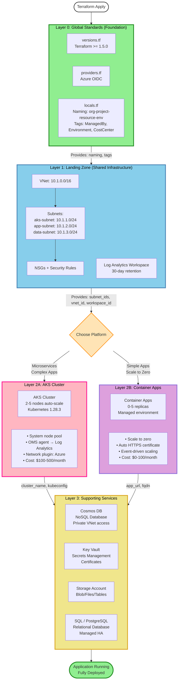
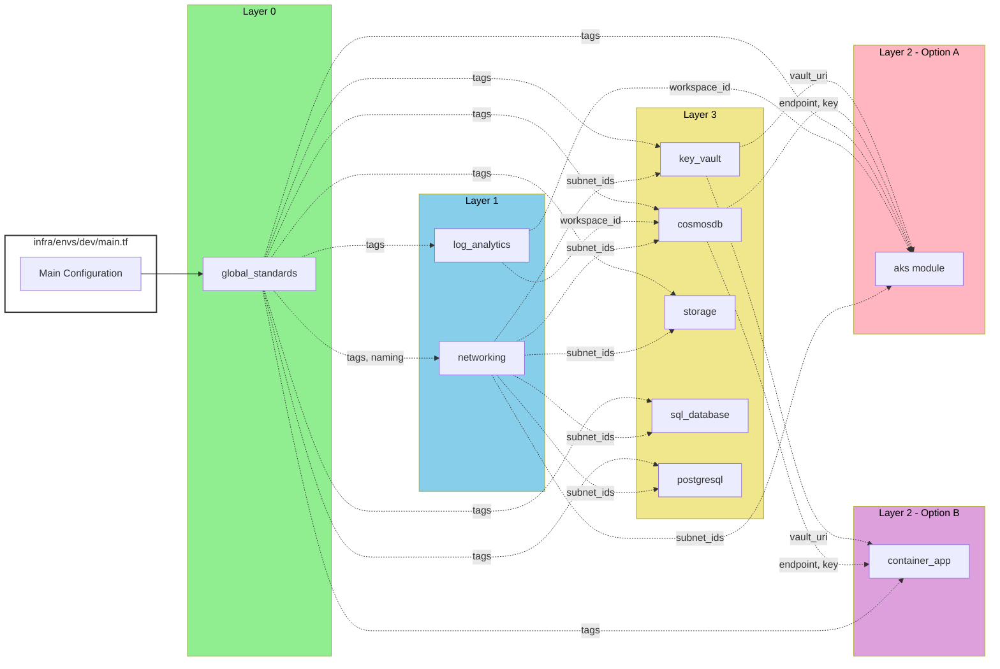
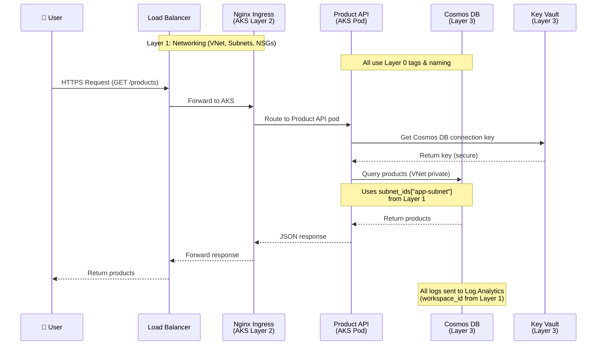

# Terraform Architecture - Quick Reference

> **One-page visual guide** to understand the layered architecture and module dependencies.

---

## 🏗️ Architecture Overview (High-Level)



---

## 📊 Module Dependency Matrix

### Complete Input/Output Table

| Layer | Module | Location | Depends On | Provides | Used By |
|-------|--------|----------|------------|----------|---------|
| **0** | `global_standards` | `infra/global/` | – | `resource_names`<br/>`common_tags`<br/>`environment`<br/>`location` | All layers |
| **1** | `networking` | `infra/modules/networking/` | `global_standards` | `vnet_id`<br/>`vnet_name`<br/>`subnet_ids` {<br/>&nbsp;&nbsp;"aks-subnet": "...",<br/>&nbsp;&nbsp;"app-subnet": "...",<br/>&nbsp;&nbsp;"data-subnet": "..."<br/>}<br/>`nsg_ids` | Layer 2, 3 |
| **1** | `log_analytics_workspace` | Environment file | `global_standards` | `workspace_id` | Layer 2, 3 |
| **2** | `aks` | `infra/modules/aks/` | `networking.subnet_ids["aks-subnet"]`<br/>`log_analytics_workspace.id`<br/>`global_standards.common_tags` | `cluster_name`<br/>`kube_config_command`<br/>`cluster_id` | Applications (kubectl) |
| **2** | `container_app` | `infra/modules/container-app/` | `global_standards.common_tags` | `app_url`<br/>`fqdn`<br/>`app_id` | External users, CI/CD |
| **3** | `cosmosdb` | `infra/modules/cosmosdb/` | `networking.subnet_ids["app-subnet"]`<br/>`log_analytics_workspace.id`<br/>`global_standards.common_tags` | `cosmosdb_endpoint`<br/>`primary_key` (sensitive)<br/>`connection_strings` (sensitive) | Layer 2 apps (env vars) |
| **3** | `key_vault` | `infra/modules/security/` | `networking.subnet_ids["app-subnet"]`<br/>`global_standards.common_tags` | `vault_uri`<br/>`vault_id` | Layer 2 apps (secrets) |
| **3** | `storage_account` | `infra/modules/storage/` | `networking.subnet_ids["app-subnet"]`<br/>`global_standards.common_tags` | `primary_connection_string`<br/>`primary_blob_endpoint` | Layer 2 apps (blob storage) |
| **3** | `sql_database` | `infra/modules/sql-database/` | `networking.subnet_ids["data-subnet"]`<br/>`global_standards.common_tags` | `server_fqdn`<br/>`connection_string` (sensitive) | Layer 2 apps (relational data) |
| **3** | `postgresql` | `infra/modules/postgresql/` | `networking.subnet_ids["data-subnet"]`<br/>`global_standards.common_tags` | `server_fqdn`<br/>`connection_string` (sensitive) | Layer 2 apps (relational data) |

---

## 🔗 Dependency Flow Diagram



---

## 📋 Module Input Requirements

### Layer 0: Global Standards
**No dependencies** - This is the foundation.

**Inputs**:
```hcl
organization_name = "contoso"
project_name      = "ecommerce"
environment       = "dev"
location          = "eastus"
cost_center       = "Engineering"
owner_email       = "devops@contoso.com"
```

**Outputs**:
```hcl
resource_names = {
  resource_group   = "contoso-ecommerce-rg-dev"
  vnet             = "contoso-ecommerce-vnet-dev"
  aks_cluster      = "contoso-ecommerce-aks-dev"
  cosmosdb_account = "contoso-ecommerce-cosmos-dev"
}

common_tags = {
  ManagedBy    = "Terraform"
  Organization = "contoso"
  Project      = "ecommerce"
  Environment  = "dev"
  CostCenter   = "Engineering"
  Owner        = "devops@contoso.com"
}
```

---

### Layer 1: Networking
**Depends on**: Layer 0 (global_standards)

**Inputs**:
```hcl
network_name  = "${var.project_name}-vnet-dev"
location      = var.location
address_space = ["10.1.0.0/16"]

subnets = {
  "aks-subnet" = {
    address_prefixes  = ["10.1.1.0/24"]
    service_endpoints = ["Microsoft.Storage", "Microsoft.KeyVault"]
  }
}

tags = module.global_standards.common_tags  # ← From Layer 0
```

**Outputs**:
```hcl
vnet_id    = "/subscriptions/.../virtualNetworks/ecommerce-vnet-dev"
vnet_name  = "ecommerce-vnet-dev"

subnet_ids = {
  "aks-subnet"  = "/subscriptions/.../subnets/aks-subnet"
  "app-subnet"  = "/subscriptions/.../subnets/app-subnet"
  "data-subnet" = "/subscriptions/.../subnets/data-subnet"
}
```

---

### Layer 1: Log Analytics
**Depends on**: Layer 0 (global_standards)

**Inputs**:
```hcl
name                = "${var.project_name}-logs-dev"
location            = var.location
resource_group_name = azurerm_resource_group.main.name
retention_in_days   = 30

tags = module.global_standards.common_tags  # ← From Layer 0
```

**Outputs**:
```hcl
workspace_id = "/subscriptions/.../workspaces/ecommerce-logs-dev"
```

---

### Layer 2: AKS Module
**Depends on**: 
- Layer 0 (global_standards) → tags
- Layer 1 (networking) → subnet_id
- Layer 1 (log_analytics) → workspace_id

**Inputs**:
```hcl
cluster_name = "${var.project_name}-aks-dev"
location     = var.location

# Dependencies
subnet_id                  = module.networking.subnet_ids["aks-subnet"]  # ← From Layer 1
log_analytics_workspace_id = azurerm_log_analytics_workspace.main.id     # ← From Layer 1
tags                       = module.global_standards.common_tags         # ← From Layer 0
```

**Outputs**:
```hcl
cluster_name         = "ecommerce-aks-dev"
kube_config_command  = "az aks get-credentials --resource-group ... --name ecommerce-aks-dev"
cluster_id           = "/subscriptions/.../managedClusters/ecommerce-aks-dev"
```

---

### Layer 2: Container Apps Module
**Depends on**: 
- Layer 0 (global_standards) → tags only

**Inputs**:
```hcl
app_name         = "${var.project_name}-app-dev"
location         = var.location
container_image  = "myregistry.azurecr.io/my-api:v1.0"

# Dependencies
tags = module.global_standards.common_tags  # ← From Layer 0
```

**Outputs**:
```hcl
app_url = "https://ecommerce-app-dev.yellowdesert-12345678.eastus.azurecontainerapps.io"
fqdn    = "ecommerce-app-dev.yellowdesert-12345678.eastus.azurecontainerapps.io"
app_id  = "/subscriptions/.../containerApps/ecommerce-app-dev"
```

---

### Layer 3: Cosmos DB Module
**Depends on**: 
- Layer 0 (global_standards) → tags
- Layer 1 (networking) → subnet_id for VNet rules
- Layer 1 (log_analytics) → workspace_id for diagnostics

**Inputs**:
```hcl
account_name      = "${var.project_name}-cosmos-dev"
location          = var.location
consistency_level = "Session"

# Network security dependencies
public_network_access_enabled = false
enable_virtual_network_filter = true
virtual_network_rules = [
  module.networking.subnet_ids["app-subnet"]  # ← From Layer 1
]

# Dependencies
log_analytics_workspace_id = azurerm_log_analytics_workspace.main.id  # ← From Layer 1
tags                       = module.global_standards.common_tags       # ← From Layer 0
```

**Outputs**:
```hcl
cosmosdb_endpoint = "https://ecommerce-cosmos-dev.documents.azure.com:443/"
primary_key       = "ABC123..." (sensitive)
connection_strings = ["AccountEndpoint=...;AccountKey=..."] (sensitive)
```

---

## 🎯 Quick Decision Guide

### When to Use Each Layer 2 Option

```
┌─────────────────────────────────────────────┐
│ Do you have multiple microservices?         │
│ ├─ YES → Use AKS                            │
│ └─ NO  → Continue ↓                         │
└─────────────────────────────────────────────┘
                 │
┌─────────────────────────────────────────────┐
│ Need Kubernetes-specific features?          │
│ (StatefulSets, DaemonSets, Helm)            │
│ ├─ YES → Use AKS                            │
│ └─ NO  → Continue ↓                         │
└─────────────────────────────────────────────┘
                 │
┌─────────────────────────────────────────────┐
│ Is this dev/test with variable traffic?     │
│ ├─ YES → Use Container Apps (scale to $0)  │
│ └─ NO  → Continue ↓                         │
└─────────────────────────────────────────────┘
                 │
┌─────────────────────────────────────────────┐
│ Team has Kubernetes expertise?              │
│ ├─ YES → Either works (choose based on     │
│ │         complexity needs)                 │
│ └─ NO  → Use Container Apps (simpler)      │
└─────────────────────────────────────────────┘
```

---

## 📦 Deployment Order

### Step-by-Step Execution

```
terraform apply
│
├─ [Step 1] Create Layer 0 (0.5 min)
│   └─ module.global_standards
│      └─ Outputs: naming, tags
│
├─ [Step 2] Create Resource Group (0.5 min)
│   └─ azurerm_resource_group.main
│
├─ [Step 3] Create Layer 1 - Networking (2 min)
│   ├─ Virtual Network
│   ├─ Subnets (aks, app, data)
│   ├─ NSGs + Security Rules
│   └─ Outputs: subnet_ids, vnet_id
│
├─ [Step 4] Create Layer 1 - Logging (1 min)
│   └─ Log Analytics Workspace
│      └─ Outputs: workspace_id
│
├─ [Step 5] Create Layer 2 (5-10 min)
│   ├─ Option A: AKS Cluster (10 min)
│   │   └─ Outputs: cluster_name, kube_config
│   │
│   └─ Option B: Container Apps (3 min)
│       └─ Outputs: app_url, fqdn
│
└─ [Step 6] Create Layer 3 (3-5 min)
    ├─ Cosmos DB
    ├─ Key Vault
    ├─ Storage Account
    └─ SQL / PostgreSQL (optional)
    
Total Time:
- AKS path: ~15-20 minutes
- Container Apps path: ~8-12 minutes
```

---

## 🔄 Data Flow Example: E-Commerce on AKS



---

## 💡 Key Takeaways

### 1. **Shared Infrastructure (Layer 0 & 1)**
- ✅ Deploy **ONCE**, used by **ALL** scenarios
- ✅ VNet, Log Analytics, naming, tags
- ✅ Cost: ~$50-100/month (shared across all apps)

### 2. **Scenario-Specific (Layer 2 & 3)**
- ⚠️ Deploy **per application/scenario**
- ⚠️ AKS or Container Apps + databases/services
- ⚠️ Cost: $100-500/month per scenario (AKS) or $0-100/month (Container Apps)

### 3. **Module Dependencies**
- 🔗 Layer 0 provides **naming and tags** → used by ALL
- 🔗 Layer 1 provides **subnet_ids, vnet_id, workspace_id** → used by Layer 2 & 3
- 🔗 Layer 2 provides **cluster_name** or **app_url** → used by applications
- 🔗 Layer 3 provides **endpoints and connection strings** → used by Layer 2 apps

### 4. **Best Practices**
- 📌 Always import Layer 0 first
- 📌 Create Layer 1 networking before Layer 2 (AKS requires subnet)
- 📌 Use VNet integration for Layer 3 services (security)
- 📌 Pass Layer 3 outputs to Layer 2 via environment variables

---

## 📚 Related Documentation

- **[Full Architecture Guide](./technical/README.md)** - Complete detailed documentation with all code
- **[Azure DevOps Setup](./AZURE-DEVOPS-SETUP.md)** - CI/CD pipeline configuration
- **[Implementation Phases](./IMPLEMENTATION-PHASES.md)** - Week-by-week rollout plan

---

**Last Updated**: February 2026  
**Framework Version**: 1.0.0  
**Terraform Version**: >= 1.5.0
