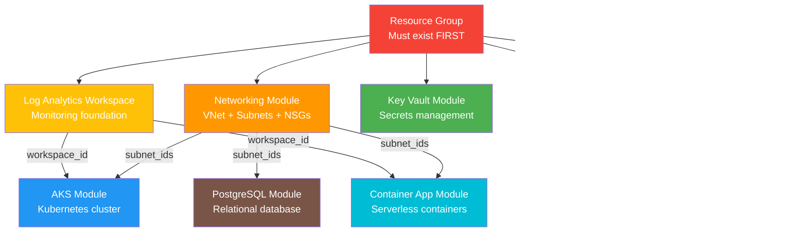

# Document 06: Diagrams Collection

This document contains all Mermaid diagrams for the framework. You can copy-paste these into any Mermaid-compatible renderer (Azure DevOps Wiki, GitHub, VS Code Mermaid plugins, mermaid.live, etc.).

---

## Diagram 1: High-Level Framework Architecture

---

## Diagram 2: Data Flow - How Values Travel Through Files

---

## Diagram 3: Demo Scenario - Complete Team Workflow

```mermaid
sequenceDiagram
    participant Andi as 🧑‍💻 Andi<br/>(Platform Team)
    participant Budi as 👨‍💻 Budi<br/>(Team Alpha)
    participant Citra as 👩‍💻 Citra<br/>(Team Beta)
    participant Dewi as 👩‍💻 Dewi<br/>(Team Gamma/CRM)
    participant Eka as 👨‍💻 Eka<br/>(Team Delta/E-com)
    participant Azure as ☁️ Azure

    Note over Andi,Azure: ACT 1: Platform Layer Setup
    Andi->>Azure: Create state storage (az CLI)
    Andi->>Andi: Edit platform/dev/dev.tfvars
    Andi->>Azure: terraform apply → VNet, Subnets, Logs, KeyVault
    Azure-->>Andi: ✅ Platform layer ready (platform-dev.tfstate)

    Note over Budi,Azure: ACT 2A: Team Alpha Request (App Layer)
    Budi->>Andi: "We need AKS + CosmosDB"
    Andi->>Andi: Set enable_aks=true, enable_cosmosdb=true in envs/dev/
    Andi->>Azure: terraform apply (reads VNets from platform via data sources)
    Azure-->>Andi: ✅ AKS + CosmosDB created
    Andi-->>Budi: "Your AKS cluster is ready!"

    Note over Citra,Azure: ACT 2B: Team Beta Request (App Layer)
    Citra->>Andi: "We need ContainerApps + PostgreSQL"
    Andi->>Andi: Set enable_container_apps=true, enable_postgresql=true
    Andi->>Azure: terraform apply
    Azure-->>Andi: ✅ ContainerApps + PostgreSQL created
    Andi-->>Citra: "Your services are ready!"

    Note over Dewi,Eka: ACT 3: Independent Teams (Pattern 2)
    
    par CRM Team works independently
        Dewi->>Dewi: Edit dev-app-crm/dev.tfvars
        Dewi->>Azure: terraform apply
        Azure-->>Dewi: ✅ CRM resources created
    and E-commerce Team works independently
        Eka->>Eka: Edit dev-app-ecommerce/dev.tfvars
        Eka->>Azure: terraform apply
        Azure-->>Eka: ✅ E-commerce resources created
    end

    Note over Andi,Azure: All teams deployed successfully!
```

---

## Diagram 4: Pattern 1 vs Pattern 2 - Side by Side

---

## Diagram 5: Module Dependency Chain

---

## Diagram 6: File Interaction in Pattern 1 (Layered Architecture)

---

## Diagram 7: Pattern 2 - How Teams Connect to Shared Infrastructure

---

## Diagram 8: State File Isolation

---

## Diagram 9: Complete Azure Resource Map After Demo

---

## Diagram 10: Team Responsibility Matrix

```mermaid
graph LR
    subgraph "Platform Team (Andi)"
        PT_RESP["Responsibilities:<br/>✅ State storage setup<br/>✅ VNet & Subnets<br/>✅ NSGs & Security<br/>✅ Log Analytics<br/>✅ Module maintenance<br/>✅ Pipeline management<br/>✅ Pattern 1 toggles<br/><br/>Skills needed:<br/>🔧 Terraform advanced<br/>🔧 Azure networking<br/>🔧 DevOps pipelines"]
    end

    subgraph "App Team - Pattern 1 (Budi/Citra)"
        P1_RESP["Responsibilities:<br/>✅ Request services to Platform<br/>✅ Test their applications<br/>✅ Report issues<br/><br/>Skills needed:<br/>📖 Basic Terraform<br/>📖 Application deployment<br/><br/>NOT responsible for:<br/>❌ Infrastructure code<br/>❌ Network config<br/>❌ Security settings"]
    end

    subgraph "App Team - Pattern 2 (Dewi/Eka)"
        P2_RESP["Responsibilities:<br/>✅ Own folder management<br/>✅ Own resource deployment<br/>✅ Own state management<br/>✅ Own PR reviews<br/>✅ Cost optimization<br/><br/>Skills needed:<br/>🔧 Intermediate Terraform<br/>🔧 Module usage<br/>🔧 Data sources<br/><br/>NOT responsible for:<br/>❌ Shared networking<br/>❌ Module internals"]
    end

    PT_RESP -->|"Provides base infra"| P1_RESP
    PT_RESP -->|"Provides shared VNet"| P2_RESP
```

---

## How to Use These Diagrams

### In Azure DevOps Wiki
Copy the Mermaid code blocks directly into an Azure DevOps Wiki page. Azure DevOps supports Mermaid natively.

### In Presentations
1. Go to [mermaid.live](https://mermaid.live)
2. Paste the Mermaid code
3. Export as PNG or SVG
4. Insert into PowerPoint/Google Slides

### In VS Code
Install the "Mermaid Preview" extension to see diagrams rendered in VS Code.

### In GitHub
Mermaid is supported in GitHub markdown files natively.

---

*Previous: [05 - Pattern 2 Demo](05-PATTERN2-DEMO.md)* | *Back to: [00 - Document Index](00-DOCUMENT-INDEX.md)*
